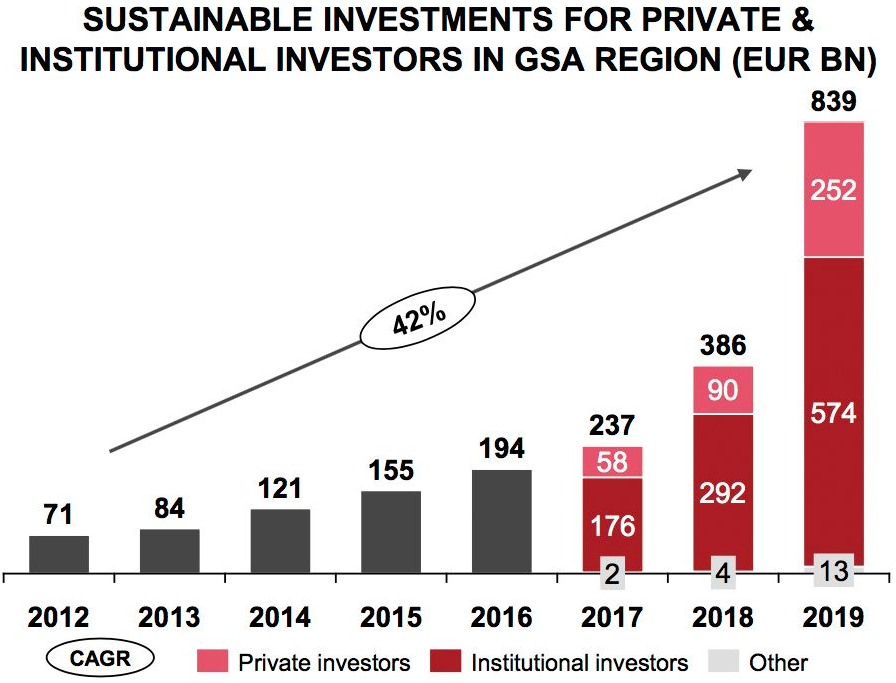
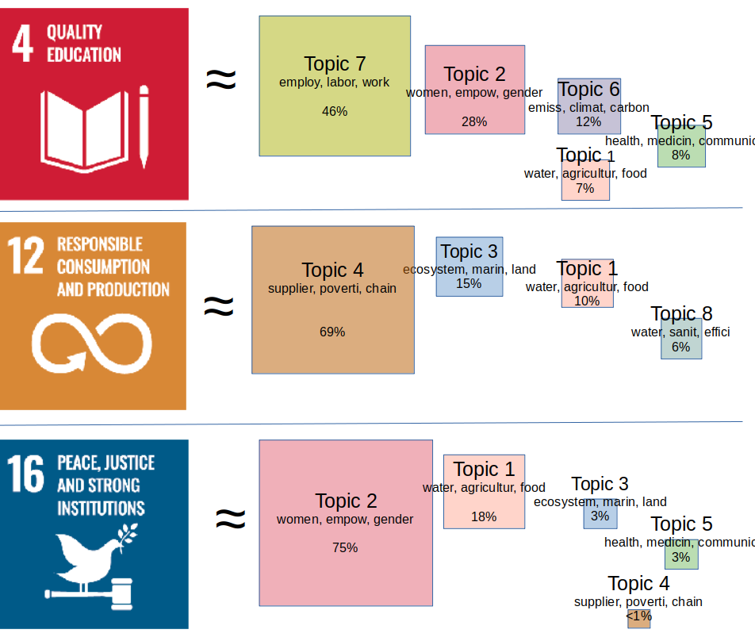

```{r setup, include=FALSE}
knitr::opts_chunk$set(warning = FALSE, message = FALSE, echo=FALSE, fig.align="center") 
```

## Motivation

- Growing interest to sustainable investments

{width=50%}

- Investment decisions integrate individual value systems
- Aligning investments with individual preferences 
    
    - how to quantify sustainability? 
    - how to compare investment possibilities?

## Motivation

- Environment, social, governance (ESG) ratings diverge:

{width=50%}


## Motivation

- @kang2022: Another source of information easily available to private investors
  - corporate responsibility reports
  - sustainability reports
  - environmental action reports
  
- A systematics e.g. in commonly accepted 17 UN sustainable development goals (SDGs) is at hand.

\hfil{width=50%}\hfil
\vspace{-0.5cm}

$\rightarrow$ leverage information from these sources via automatic topic extraction while considering the value system established by the 17 SDGs.


## Methods available

- Topic analysis: represent each document/ context in a low dimensional latent topic space:
  - Specific for topic extraction: Latent (probabilistic) Semantic Analysis, Latent Dirichlet allocation (LDA) and extentions thereof.
  - General purpose matrix factorization (MF) methods: Principal component analysis, Non-negativ matrix factorization, probabilistic versions and extensions thereof.
  
\hfil{width=50%}\hfil


## Methods available

- How to embed known structure or side information in the unsupervised techniques? 
  - keyword seeded LDA: @watanabe2022 and @eshima2023
  - graph regularized MF: @rao2015 and @zahng2020_graph (recommendations)
  - common subspace projection/ subspace alignment (@basura2013 for domain adaptation)
  - matrix co-factorization (MCF) techniques: @fang2011 (user communities) and @luo2019 (recommender systems)
  
$\rightarrow$ adopt MCF for topic extraction with side information.


## Our approach

Decompose two term-context matrices ($M$ from the sustainability reports  and $C$ from the SDG texts) jointly.

\begin{equation*}M \approx U^\top V \text{ and } C \approx U^\top Q \end{equation*}

\hfil{width=100%}\hfil

- $M$ is the (weighted) term-context matrix for the corporate reports with dimensions $(p\times n)$, where $p$ is the joint vocabulary.
- $C$ is the (weighted) term-context matrix for the sustainability goals with dimensions $(p\times m)$, where $p$ is again the joint vocabulary.
- $U$ is the term-topic representation matrix of dimensions $(p\times k)$, where $k$ is the number of topics.
- $V$/$Q$ is the context-topic representation matrix for the reports/SGDs of dimensions $(k\times n)$.


## Our approach

The associated MCF problem is then:

\[\min(||M - U^\top V||^2 + \lambda ||C-U^\top Q||^2)\]

where $\lambda$ adapts the importance of the loss on the second factorization term.

To preserve the non-negativity of the entries in $M$ and $C$, to inhance interpretability $\rightarrow$ restrict the components to be non-negative:

\[\text{s.t. } U, V,Q \geq 0 \text{ elementwise.}  \]

<!--
## Our approach

- why to consider side information? align the topics with a known structure
- why a MCF method? flexible representation in a common low dimensional space
- why Frobenius norm? fast optimization, but other loss specifications are possible.
- why non-negative MCF? enhances the interpretability and sparsity of the resulting topics.
-->

## The algorithm

- alternating minimization/ alternating projection
- hierarchical non-negative alternating least squares (HALS) of @cichocki2007 
- with a modification for the co-factorization setup

\begin{algorithm}[H]
\begin{algorithmic}
\WHILE{not converged}
\FOR{$k=1$ to $K$}
\STATE update $V_k\leftarrow \max\left(\frac{U_k(M-U_{-k}^\top V_{-k})}{U_kU_k^\top },0\right)$
\STATE update $Q_k\leftarrow \max\left(\frac{U_k(C-U_{-k}^\top Q_{-k})}{U_kU_k^\top},0\right)$
\STATE update $U_k^\top \leftarrow \max\left(\frac{(M-U_{-k}^\top V_{-k})V_k^\top + \lambda (C-U_{-k}^\top Q_{-k})Q_k^\top}{ V_k^\top V_k  + \lambda Q_k^\top Q_k },0\right)$
\ENDFOR
\ENDWHILE
\end{algorithmic}
\caption{HALS algorithm for MCF}
\end{algorithm}

$X_k$ denotes the $k$th row of the matrix $X$ and $X_{-k}$ denotes the matrix without its $k$th row.


## The data

- Corporate responsibility/sustainability reports: AAPL, AMZ, DELL, GOOG, IBM, INTC, MSFT, SSU
- Time Period: 2013 (or later)-2022
- 17 UN SDGs texts

- Bag-of-words (two-gramms) $\rightarrow$ term-context representations with the pooled vocabulary


## Optimal $K$ and $\lambda$

- find the optimal $k$ and $\lambda$ in a data-driven fashion, via maximizing the **mean coherence**

- mean coherence $\overline{coh}$: the mean of the logratio topic coherence: $\log(\epsilon+ TCM_{x,y}) - \log(TCM_{y,y})$  for two terms $x$, $y$ with $TCM$ being the in-sample term co-occurrence matrix.

- for $K=8, \lambda=0$:   $coh_{sustainability\_reports} =-1.3048, coh_{SDGs}=  -7.7671 , \overline{coh} =    {\color{red}{-4.5359}}$
- for $K=8, \lambda=350$:   $coh_{sustainability\_reports} =-2.6230, coh_{SDGs}=    -0.9374 , \overline{coh} =     {\color{teal}{ -1.7802}}$


## Optimal $K$ and $\lambda$


```{r}
load("cohs_tech.RData")
Ks<-seq(5,15)
lams<-seq(0,700,50)

```


```{r}
par(lwd=2)
plot(lams,loess(I(cohs$coh[1,])~lams)$fitted, type="l",col=1, ylim=c(-5,-1),axes=F,xlab=bquote(lambda),ylab="mean coherence")
for (i in 2:(length(Ks))){
    #lines(lams,cohs$coh[i,],col=i)
    lsm<-loess.smooth(lams,cohs$coh[i,],span=0.55, degree=4)
    lines(lsm$x,lsm$y,col=i)
}
points(lams[which(cohs$coh==max(cohs$coh),arr.ind = T)[2]],max(loess(cohs$coh[4,]~lams)$fitted),col=2,pch="I")
text(lams[which(cohs$coh==max(cohs$coh),arr.ind = T)[2]],max(cohs$coh),"K=8",col=2,pos=3)
axis(1)
axis(2)
```

```{r}
# plot(lams,cohs$coh[1,], type="l",col=1, ylim=c(-5,-1),axes=F,xlab=bquote(lambda),ylab="Coherence")
# for (i in 2:(length(Ks))){
#   lines(lams,cohs$coh[i,],col=i)
# }
# points(lams[which(cohs$coh==max(cohs$coh),arr.ind = T)[2]],max(cohs$coh[4,]),col=2,pch="I")
# text(lams[which(cohs$coh==max(cohs$coh),arr.ind = T)[2]],max(cohs$coh),"K=8",col=2,pos=3)
# axis(1)
# axis(2)
```


## Results: the topics

```{r, warnings=F, messages=F}
library(wordcloud)
load("out_k8_lam350.RData")
U<-out$U
```

```{r, warnings=F, messages=F}
# par(mfrow=c(2,4),mar=rep(0,4),xpd=T)
# for( i in 1:nrow(U)){
#   wordcloud(colnames(U), U[i,], max.words = 20, scale=c(2,0.5),main=paste("topic",i,":",out$tnames[i]))
# }

```


```{r, warnings=F, messages=F}

#plot_topic_hist
par(mfrow=c(2,1))
topic_names<-paste0("topic ", 1:length(out$tnames),": ",out$tnames)
topic_props<-apply(out$V,1,sum); topic_props<-topic_props/sum(topic_props)
data_topics<-data.frame(topic_names,topic_props)
data_topics<-data_topics[order(data_topics$topic_props, decreasing =F),]

plot(c(0,0),c(0,0),type="n", ylim=c(0,nrow(data_topics)), xlim=c(0,0.5),axes=F, xlab="topic proportion",ylab="", main="topics in reports")
for(i in 1:nrow(data_topics)){
  lines(c(0,data_topics[i,2]), c(i,i))
  text(data_topics[i,2],i,data_topics[i,1], pos=4)
}
axis(1)

topic_props2<-apply(out$Q,1,sum); topic_props2<-topic_props2/sum(topic_props2)
data_topics<-data.frame(topic_names,topic_props2)
data_topics<-data_topics[order(data_topics$topic_props2, decreasing =F),]

plot(c(0,0),c(0,0),type="n", ylim=c(0,nrow(data_topics)), xlim=c(0,0.5),axes=F, xlab="topic proportion",ylab="", main="topics in SDGs")
for(i in 1:nrow(data_topics)){
  lines(c(0,data_topics[i,2]), c(i,i))
  text(data_topics[i,2],i,data_topics[i,1], pos=4)
}
axis(1)

```

## Results: the topics

{width=90%}

```{r}
#out$Q[,16]
#dim(out$Q)
```

<!--
## Results: the distances

- distance matrix
-->
```{r}
load("min_dist_norm.RData")

year<-sapply(rownames(min_dist_norm),function(x){strsplit(x,"_")[[1]][2]})
min_dist_norm<-min_dist_norm[year>=2018,]
# image(t(min_dist_norm), oldstyle = T, axes=F,col=scales::alpha(colorspace::diverge_hcl(12,h=c(128,380),c=98,l=c(65,90),power=1)))

coords<-seq(0,nrow(min_dist_norm),5)/(nrow(min_dist_norm))
coords2<-c(0,seq(1,17,1)/17)
names0<-sapply(rownames(min_dist_norm),function(x){strsplit(x,"_")[[1]][1]})
names1<-names0[!duplicated(names0)]
names2<-paste0("G",1:17)

# 
# par(xpd=T)
# for(i in 1:length(coords)){
#   segments(-0.05,coords[i],1.05,coords[i])#add line
#   text(-0.1,coords[i]+0.05,names1[i])
# }
# for(i in 1:length(coords2)){
#   text(coords2[i]*1.07,1.1,names2[i])
# }
```
<!--
## Results: the distances
-->
```{r}
i<-4 #1,4,9,12 Education
Q<-out$Q; Vs<-out$Vs
#out$Qs
names<-colnames(Vs)
```


```{r}
library(scales)
#parallel coordinate plot

ind<-matrix(NA,nrow(min_dist_norm),length(names))
cols<-rep(1,nrow(min_dist_norm))
for(i in 2:length(names)){
 cols[grepl(names[i],rownames(min_dist_norm))]<-i
}
satur<-rep(seq(0.1,1,0.1),times=length(names))

# plot(1:ncol(min_dist_norm),min_dist_norm[1,],col=NA,ylim=c(0,1),axes=F,ylab="norm. distance",xlab="")
# for(i in 1:nrow(min_dist_norm)){
#   lines(1:ncol(min_dist_norm),min_dist_norm[i,],col=alpha(cols[i],satur[i]))
# }
# axis(2)
# axis(1,at=1:17,labels=paste0("G",1:17),cex.axis=0.5)
# legend(1,0.1,col=1:2,lty=1,legend=names[1:2],cex=0.7, bty="n")
# legend(4,0.1,col=3:4,lty=1,legend=names[3:4],cex=0.7, bty="n")
# legend(7,0.1,col=5:6,lty=1,legend=names[5:6],cex=0.7, bty="n")
# legend(10,0.1,col=7:8,lty=1,legend=names[7:8],cex=0.7, bty="n")

```


## Results: approximation in two dimensions


```{r}
load("inf_comps.RData")

i=4
mycols<-c("chartreuse3", "darkred", "blueviolet","coral","darkblue","deepskyblue3","darkgoldenrod","azure4")
names3<-sapply(colnames(Vs),function(x){strsplit(x,"_")[[1]][1]})
years<-sapply(colnames(Vs),function(x){strsplit(x,"_")[[1]][2]})
cols<-scales::alpha(mycols[as.numeric(as.factor(names3))],0.5)
ymax<-max(c(Q[inf_comps[i,2],paste0("Goal_",i)],Vs[inf_comps[i,2],]))
xmax<-max(c(Q[inf_comps[i,1],paste0("Goal_",i)],Vs[inf_comps[i,1],]))
plot(Q[inf_comps[i,1],paste0("Goal_",i)], Q[inf_comps[i,2],paste0("Goal_",i)], xlab=paste("Topic", inf_comps[i,1]),ylab=paste("Topic", inf_comps[i,2]),col=NA,
     ylim=c(0,ymax), xlim=c(0,xmax), axes=F)
text(Q[inf_comps[i,1],paste0("Goal_",i)], Q[inf_comps[i,2],paste0("Goal_",i)], paste0("Goal_",i), col=2,cex=2)
points(Vs[inf_comps[i,1],], Vs[inf_comps[i,2],],col=cols, pch=16)
text(Vs[inf_comps[i,1],], Vs[inf_comps[i,2],],years,cex=0.9,col =cols,pos=4)
mycols0<-scales::alpha(mycols,0.3)
axis(1)
axis(2)

## polygons
# library(splancs);
# cha<-function(x,y){
# chull(x,y)->i
# return(areapl(cbind(x[i],y[i])))
# }
# mycols0<-scales::alpha(mycols,0.3)
# for(j in 1:length(names1)){
#   x<-Vs[inf_comps[i,1],names3==names1[j]]; y<-Vs[inf_comps[i,2],names3==names1[j]]
#   k<-chull(x,y);
#   points(x,y, col=mycols0[j], pch=16);
#   polygon(x[k],y[k],col=mycols0[j], border=NA);
#   #The area
#   cha(x,y);
# }

legend(0,220, fill=mycols0[1:3],legend=names1[1:3],bty="n")
legend(30,220, fill=mycols0[4:6],legend=names1[4:6],bty="n")
legend(70,220, fill=mycols0[7:8],legend=names1[7:8],bty="n")
```
<!--
## Results: individual preferences 

- construct your own goal preferences: e.g. equal weights for SDGs 4, 12,16
-->
```{r}
weights<-c(0,0,0,10,0,0,0,0,0,0,0,10,0,0,0,10,0)
Q<-Q[,match(paste0("Goal_",1:17),colnames(Q))]
weights<-weights/sum(weights)
b<-matrix(weights,,1)
mygoal<-t(U)%*%Q%*%b

#score
myscore<-Q%*%b

#most informative
myscore0<-myscore
my_comps<-which.max(myscore0)
myscore0[my_comps]<-0
my_comps<-c(my_comps,which.max(myscore0))
```

```{r}
# par(xpd=T)
# ymax<-max(c(myscore[my_comps[2]],Vs[my_comps[2],]))
# xmax<-max(c(myscore[my_comps[1]],Vs[my_comps[1],]))
# plot(myscore[my_comps[1]], myscore[my_comps[2]], xlab=paste("Topic", my_comps[1]),ylab=paste("Topic", my_comps[2]),col=NA,
#      ylim=c(0,ymax), xlim=c(0,xmax),axes=F)
# text(myscore[my_comps[1]], myscore[my_comps[2]], paste0("my goal"), col=2,cex=2)
# 
# points(Vs[my_comps[1],], Vs[my_comps[2],],col=cols, pch=16)
# text(Vs[my_comps[1],], Vs[my_comps[2],],years,cex=0.9,col =cols,pos=4)
# axis(1)
# axis(2)
# 
# # for(j in 1:length(names1)){
# #   x<-Vs[my_comps[1],names3==names1[j]]; y<-Vs[my_comps[2],names3==names1[j]]
# #   k<-chull(x,y);
# #   points(x,y, col=mycols0[j], pch=16);
# #   polygon(x[k],y[k],col=mycols0[j], border=NA);
# #   #The area
# #   cha(x,y);
# # }
# 
# legend(0,220, fill=mycols0[1:3],legend=names1[1:3],bty="n")
# legend(50,220, fill=mycols0[4:6],legend=names1[4:6],bty="n")
# legend(100,220, fill=mycols0[7:8],legend=names1[7:8],bty="n")
```


```{r}
# #year
# years = unique(sapply(colnames(Vs), function(x){substr(x,nchar(x)-3, nchar(x))}))
# year = 2022
# firms = sapply(colnames(Vs), function(x){strsplit(x,split="_")[[1]][1]})
# 
# if(year%in%years){
#   Vsy<-Vs[,grepl(year,colnames(Vs))]
# } else {
#   Vsy<-aggregate(t(Vs), by=list(firms),mean)
#   rownames(Vsy)<-Vsy[,1]
#   Vsy<-t(Vsy[,-1]); Vsy<-as.matrix(Vsy)
# }

```


```{r}
# par(xpd=T)
# ymax<-max(c(myscore[my_comps[2]],Vsy[my_comps[2],]))
# xmax<-max(c(myscore[my_comps[1]],Vsy[my_comps[1],]))
# plot(myscore[my_comps[1]], myscore[my_comps[2]], xlab=paste("Topic", my_comps[1]),ylab=paste("Topic", my_comps[2]),col=NA,
#      ylim=c(0,ymax), xlim=c(0,xmax),axes=F)
# text(myscore[my_comps[1]], myscore[my_comps[2]], paste0("my goal"), col=2)
# text(Vsy[my_comps[1],], Vsy[my_comps[2],],colnames(Vsy),cex=0.8)
# axis(1)
# axis(2)
```

```{r}
compute_dist<-function(x0,x1){
  dist<-sqrt(sum((x0-x1)^2))
  return(dist)
}
compute_col_dist<-function(x0mat,x1){
  dist<-apply(x0mat,2,compute_dist,x1=x1)
  return(dist)
}
mydist<-compute_col_dist(out$V,myscore)
min_dist<-aggregate(as.matrix(mydist),by=list(names(mydist)), min)
mynames<-min_dist[,1]
min_dist<-min_dist[,-1]; names(min_dist)<-mynames
```

```{r}
year = 2022
if(year%in%years){
 min_disty<-min_dist[grepl(year,names(min_dist))]
} else {
  min_disty<-aggregate(as.matrix(min_dist_norm), by=list(firms),mean)
  mynames<-min_disty[,1]
  min_disty<-min_disty[,-1]; names(min_disty)<-mynames
}
nms<-sapply(names(min_disty)[order(min_disty)],function(x){substr(strsplit(x,"/")[[1]][3],1,9)})
#paste(nms)

```
<!--
- Distance-based rating: `r nms[1]`, `r nms[2]`, `r nms[3]`
-->

## Results: the distributional distances

- Consider reports/SDGs as **distributions**/**histogramms**

- Find an optimal transport plan $T^*$, such that:
\begin{align*}\min_{T} &\sum_i\sum_j T_{ij}Cost_{ij},\\
s.t. &T\mathbf 1_n = \mathbf p, T^\top \mathbf 1_n = \mathbf q,
\end{align*}
where $Cost\in\mathbb R^{n\times n}$ is the cost matrix, $T\in\mathbb R^{n\times n}$ is the transport plan matrix and $\mathbf p,\mathbf q$ are (term) probability vectors.

\hfil{width=40%}\hfil

(Source: http://alexhwilliams.info/itsneuronalblog/2020/10/09/optimal-transport/#f5b )


## Results: distributional distances

- Consider reports/SDGs as **distributions**/**histogramms**

- Find an optimal transport plan $T^*$, such that:
\begin{align*}\min_{T} &\sum_i\sum_j T_{ij}Cost_{ij},\\
s.t. &T\mathbf 1_n = \mathbf p, T^\top \mathbf 1_n = \mathbf q,
\end{align*}

@lee-etal-2022 cosine dissimilarity as cost for optimal transport plan (contextualized mover’s distance,CMD):
\[Cost_{ij}^{CMD}=1-\frac{x_i^\top x_j}{||x_i||||x_j||}\]

with $x_k, k=1,\ldots,n$ being the topic-term embedding for the $k$th term. 

- Take the minimized total cost:
\[Cost^* = \sum_i\sum_j T^*_{ij}Cost^{CMD}_{ij}\]
to compare reports and SDGs as word distributions.


## Results: distributional distances

```{r}
load("Wdist.RData")
load("firm_names.RData")

Wdist_sc<-Wdist
#Wdist_sc<-Wdist2/matrix(apply(Wdist2,1,max),nrow(Wdist2),ncol(Wdist2))

firm_names_agg<-aggregate(firm_names, by=list(firm_names),length)[,1]
year<-sapply(firm_names_agg,function(x){strsplit(x,"_")[[1]][2]})
Wdist_sc<-Wdist_sc[,year>=2018]

#image(Wdist_sc,oldstyle = T, axes=F,col=(scales::alpha(RColorBrewer::brewer.pal(11, "RdYlGn"),0.99)),zlim=c(0,1))
fields::image.plot(Wdist_sc,axes=F,col=rev(scales::alpha(RColorBrewer::brewer.pal(11, "RdYlGn"),0.99)),zlim=c(0,0.5))

coords<-seq(0,ncol(Wdist_sc),5)/(ncol(Wdist_sc))
coords2<-c(0,seq(1,17,1)/17)
names0<-sapply(firm_names,function(x){strsplit(x,"_")[[1]][1]})
names1<-names0[!duplicated(names0)]
names2<-paste0("G",1:17)

par(xpd=T)
for(i in 1:length(coords)){
  segments(-0.05,coords[i],1.05,coords[i])#add line
  text(-0.1,coords[i]+0.05,names1[i])
}
for(i in 1:length(coords2)){
  text(coords2[i]*1.07,1.1,names2[i])
}

```

## Results: individual preferences
```{r}
load("myWdist.RData")
Wdist_sc<-myWdist
Wdist_sc<-Wdist_sc[,year>=2018]

par(mfrow=c(1,2))
#image(Wdist_sc,oldstyle = T, axes=F,col=(scales::alpha(RColorBrewer::brewer.pal(11, "RdYlGn"),0.99)),zlim=c(0,1))
fields::image.plot(Wdist_sc,axes=F,col=rev(scales::alpha(RColorBrewer::brewer.pal(11, "RdYlGn"),0.99)),zlim=c(0,0.5))

coords<-seq(0,ncol(Wdist_sc),5)/(ncol(Wdist_sc))
coords2<-c(0,seq(1,nrow(myWdist),1)/nrow(myWdist))
names0<-sapply(firm_names,function(x){strsplit(x,"_")[[1]][1]})
names1<-names0[!duplicated(names0)]
names2<-paste0("M",1:nrow(myWdist))

par(xpd=T)
for(i in 1:length(coords)){
  segments(-0.15,coords[i],1.15,coords[i])#add line
  text(-0.3,coords[i]+0.05,names1[i])
}
for(i in 1:length(coords2)){
  text(coords2[i]*1.25,1.1,names2[i])
}

plot(1:10,1:10, axes=F,col=NA, ylab="", xlab="")
text(3,8,"M1: 1/3 G4 + 1/3 G12 + 1/3 G16",pos=4)
text(3,7,"M2: 1/2 G4 + 1/4 G12 + 1/4 G16",pos=4)
text(3,6,"M3: 2/3 G4 + 1/6 G12 + 1/6 G16",pos=4)
text(3,5,"M4: 3/4 G4 + 1/8 G12 + 1/8 G16",pos=4)
text(3,4,"M5: 4/5 G4 + 1/10 G12 + 1/10 G16",pos=4)
```

## Summary

- Topic extraction with side information $\rightarrow$ low dim. representation in a prestructured topic space.

- Projection on a common subspace via non-negative matrix co-factorization, using an algorithm which is easily implemented and delivers interpretable results.

- The resulting topic-term embeddings are used to compare the documents via the optimal transport metric which assists financial decisions under SDGs based preferences.


## References {.allowframebreaks}

<div id="references"></div>

