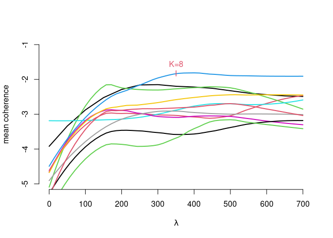

## Motivation

-   Growing interest to sustainable investments

<figure>

<figcaption aria-hidden="true">Source: Consultancy.eu</figcaption>
</figure>

-   Investment decisions integrate individual value systems

-   Aligning investments with individual preferences

    -   how to quantify sustainability?
    -   how to compare investment possibilities?

-   Environment, social, governance (ESG) ratings diverge:

<figure>

<figcaption aria-hidden="true">Ratings of different providers against a
benchmark. Source: Berg,
Kölbel, and Rigobon (2022) “Aggregated confusion The Divergence
of ESG Ratings”</figcaption>
</figure>

## Motivation

-   Kang and Kim (2022): Another source of information easily available
    to private investors
    -   corporate responsibility reports
    -   sustainability reports
    -   environmental action reports
-   A systematics e.g. in commonly accepted 17 UN sustainable
    development goals (SDGs) is at hand.

→ leverage information from these sources via automatic topic extraction
while considering the value system established by the 17 SDGs.

## Methods available

-   Topic analysis: represent each document/ context in a low
    dimensional latent topic space:
    -   Specific for topic extraction: Latent (probabilistic) Semantic
        Analysis, Latent Dirichlet allocation (LDA) and extentions
        thereof.
    -   General purpose matrix factorization (MF) methods: Principal
        component analysis, Non-negativ matrix factorization,
        probabilistic versions and extensions thereof.

-   How to embed known structure or side information in the unsupervised
    techniques?
    -   keyword seeded LDA: Watanabe and Zhou (2022) and Eshima, Imai,
        and Sasaki (2023)
    -   graph regularized MF: Rao et al. (2015) and Zhang et al. (2020)
        (recommendations)
    -   common subspace projection/ subspace alignment (Fernando et
        al. (2013) for domain adaptation)
    -   matrix co-factorization (MCF) techniques: Fang and Si (2011)
        (user communities) and Luo et al. (2019) (recommender systems)

→ adopt MCF for topic extraction with side information.

## Our approach

Decompose two term-context matrices (*M* from the sustainability reports
and *C* from the SDG texts) jointly.

-   *M* is the (weighted) term-context matrix for the corporate reports
    with dimensions (*p*×*n*), where *p* is the joint vocabulary.
-   *C* is the (weighted) term-context matrix for the sustainability
    goals with dimensions (*p*×*m*), where *p* is again the joint
    vocabulary.
-   *U* is the term-topic representation matrix of dimensions (*p*×*k*),
    where *k* is the number of topics.
-   *V*/*Q* is the context-topic representation matrix for the
    reports/SGDs of dimensions (*k*×*n*).

## Our approach

The associated MCF problem is then:

min (||*M*−*U*⊤*V*||2+*λ*||*C*−*U*⊤*Q*||2)

where *λ* adapts the importance of the loss on the second factorization
term.

To preserve the non-negativity of the entries in *M* and *C*, to inhance
interpretability → restrict the components to be non-negative:

s.t. *U*,*V*,*Q*≥0 elementwise.

<!--
## Our approach

- why to consider side information? align the topics with a known structure
- why a MCF method? flexible representation in a common low dimensional space
- why Frobenius norm? fast optimization, but other loss specifications are possible.
- why non-negative MCF? enhances the interpretability and sparsity of the resulting topics.
-->

## The algorithm

-   alternating minimization/ alternating projection
-   hierarchical non-negative alternating least squares (HALS) of
    Cichocki, Zdunek, and Amari (2007)
-   with a modification for the co-factorization setup

*X**k* denotes the *k*th row of the matrix *X* and
*X*−*k* denotes the matrix without its *k*th row.

## The data

-   Corporate responsibility/sustainability reports: AAPL, AMZ, DELL,
    GOOG, IBM, INTC, MSFT, SSU

-   Time Period: 2013 (or later)-2022

-   17 UN SDGs texts

-   Bag-of-words (two-gramms) → term-context representations with the
    pooled vocabulary

## Optimal *K* and *λ*

-   find the optimal *k* and *λ* in a data-driven fashion, via
    maximizing the **mean coherence**

-   mean coherence $\overline{coh}$: the mean of the logratio topic
    coherence:
    log (*ϵ*+*T**C**M**x*, *y*) − log (*T**C**M**y*, *y*)
    for two terms *x*, *y* with *T**C**M* being the in-sample term
    co-occurrence matrix.

-   for *K* = 8, *λ* = 0:
    $coh\_{sustainability\\\_reports} =-1.3048, coh\_{SDGs}= -7.7671 , \overline{coh} = {\color{red}{-4.5359}}$

-   for *K* = 8, *λ* = 350:
    $coh\_{sustainability\\\_reports} =-2.6230, coh\_{SDGs}= -0.9374 , \overline{coh} = {\color{teal}{ -1.7802}}$

## Optimal *K* and *λ*

## Results: the topics

## Results: the topics

<!--
## Results: the distances

- distance matrix
-->
<!--
## Results: the distances
-->

## Results: approximation in two dimensions

<!--
## Results: individual preferences 

- construct your own goal preferences: e.g. equal weights for SDGs 4, 12,16
-->

<!--
- Distance-based rating: INTC_2022, AMZ_2022., DELL_2022
-->

## Results: the distributional distances

-   Consider reports/SDGs as **distributions**/**histogramms**

-   Find an optimal transport plan *T*\*, such that: where
    *C**o**s**t* ∈ ℝ*n* × *n* is the cost matrix,
    *T* ∈ ℝ*n* × *n* is the transport plan matrix and
    **p**, **q** are (term) probability vectors.

(Source:
<http://alexhwilliams.info/itsneuronalblog/2020/10/09/optimal-transport/#f5b>
)

## Results: distributional distances

-   Consider reports/SDGs as **distributions**/**histogramms**

-   Find an optimal transport plan *T*\*, such that:

Lee et al. (2022) cosine dissimilarity as cost for optimal transport
plan (contextualized mover’s distance,CMD):
$$Cost\_{ij}^{CMD}=1-\frac{x\_i^\top x\_j}{||x\_i||||x\_j||}$$

with *x**k*, *k* = 1, …, *n* being the topic-term embedding
for the *k*th term.

-   Take the minimized total cost:
    *C**o**s**t*\* = ∑*i*∑*j**T**i**j*\**C**o**s**t**i**j**C**M**D*
    to compare reports and SDGs as word distributions.

## Results: distributional distances

## Results: individual preferences

## Summary

-   Topic extraction with side information → low dim. representation in
    a prestructured topic space.

-   Projection on a common subspace via non-negative matrix
    co-factorization, using an algorithm which is easily implemented and
    delivers interpretable results.

-   The resulting topic-term embeddings are used to compare the
    documents via the optimal transport metric which assists financial
    decisions under SDGs based preferences.

## References

Berg, Florian, Julian F Kölbel, and Roberto Rigobon. 2022. “Aggregate Confusion: The Divergence of ESG
Ratings\*.” *Review of Finance* 26 (6): 1315–44.
<https://doi.org/10.1093/rof/rfac033>.

Cichocki, Andrzej, Rafal Zdunek, and Shun-ichi Amari. 2007.
“Hierarchical ALS Algorithms for Nonnegative Matrix and 3D Tensor
Factorization.” In *Independent Component Analysis and Signal
Separation*, edited by Mike E. Davies, Christopher J. James, Samer A.
Abdallah, and Mark D. Plumbley, 169–76. Berlin, Heidelberg: Springer
Berlin Heidelberg.

Eshima, Shusei, Kosuke Imai, and Tomoya Sasaki. 2023. “Keyword Assisted
Topic Models.” <https://arxiv.org/abs/2004.05964>.

Fang, Yi, and Luo Si. 2011. “Matrix Co-Factorization for Recommendation
with Rich Side Information and Implicit Feedback.” In *Proceedings of
the 2nd International Workshop on Information Heterogeneity and Fusion
in Recommender Systems*, 65–69. HetRec ’11. New York, NY, USA:
Association for Computing Machinery.
<https://doi.org/10.1145/2039320.2039330>.

Fernando, Basura, Amaury Habrard, Marc Sebban, and Tinne Tuytelaars.
2013. “Unsupervised Visual Domain Adaptation Using Subspace Alignment.”
In *2013 IEEE International Conference on Computer Vision*, 2960–67.
<https://doi.org/10.1109/ICCV.2013.368>.

Kang, Hyewon, and Jinho Kim. 2022. “Analyzing and Visualizing Text
Information in Corporate Sustainability Reports Using Natural Language
Processing Methods.” *Applied Sciences* 12 (11).
<https://doi.org/10.3390/app12115614>.

Lee, Seonghyeon, Dongha Lee, Seongbo Jang, and Hwanjo Yu. 2022. “Toward
Interpretable Semantic Textual Similarity via Optimal Transport-Based
Contrastive Sentence Learning.” In *Proceedings of the 60th Annual
Meeting of the Association for Computational Linguistics (Volume 1: Long
Papers)*, 5969–79. Dublin, Ireland: Association for Computational
Linguistics. <https://doi.org/10.18653/v1/2022.acl-long.412>.

Luo, Ling, Haoran Xie, Yanghui Rao, and Fu Lee Wang. 2019. “Personalized
Recommendation by Matrix Co-Factorization with Tags and Time
Information.” *Expert Systems with Applications* 119: 311–21.
https://doi.org/<https://doi.org/10.1016/j.eswa.2018.11.003>.

Rao, Nikhil, Hsiang-Fu Yu, Pradeep K Ravikumar, and Inderjit S Dhillon.
2015. “Collaborative Filtering with Graph Information: Consistency and
Scalable Methods.” In *Advances in Neural Information Processing
Systems*, edited by C. Cortes, N. Lawrence, D. Lee, M. Sugiyama, and R.
Garnett. Vol. 28. Curran Associates, Inc.
<https://proceedings.neurips.cc/paper_files/paper/2015/file/f4573fc71c731d5c362f0d7860945b88-Paper.pdf>.

Watanabe, Kohei, and Yuan Zhou. 2022. “Theory-Driven Analysis of Large
Corpora: Semisupervised Topic Classification of the UN Speeches.”
*Social Science Computer Review* 40 (2): 346–66.
<https://doi.org/10.1177/0894439320907027>.

Zhang, Yupei, Yue Yun, Huan Dai, Jiaqi Cui, and Xuequn Shang. 2020.
“Graphs Regularized Robust Matrix Factorization and Its Application on
Student Grade Prediction.” *Applied Sciences* 10 (5).
<https://doi.org/10.3390/app10051755>.

[1] Hochschule für Wirtschaft und Recht Berlin; <osipenko@hwr-berlin.de>
