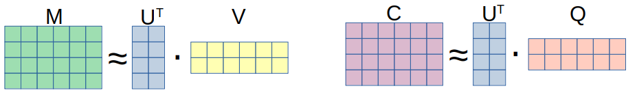

```{r setup, include=FALSE}
knitr::opts_chunk$set(warning = FALSE, message = FALSE, echo=FALSE) 
```

## Motivation

- Growing interest to sustainable investments
- Investment decisions based not only on expected return considerations but also relying on individual value system
- Aligning investments with individual preferences - how to quantify sustainability? how to compare investment possibilities?

## Motivation

- Environment, social, governance (ESG) ratings diverge:

{width=50%}

- The weighting systems behind the ratings are partly intransparent and cubersome to understand.


## Motivation

- Another source of information easily available to private investors
  - corporate responsibility reports
  - sustainability reports
  - environmental action reports
  
- A systematic e.g. in commonly accepted 17 UN sustainable development goals (SDGs) is at hand.

{width=50%}
  
$\rightarrow$ leverage information from these sources via automatic topic extraction while considering the value system established by the 17 SDGs.


## Methods available

- Topic analysis: represent each document in a low dimensional latent topic space
  - Specific for topic extraction: Latent (probabilistic) Semantic Analysis, Latent Dirichlet allocation (LDA),...
  - General purpose matrix factorization (MF) methods: Principal component analysis, Non-negativ matrix factorization, probabilistic versions and extensions thereof, ...
  
{width=50%}


## Methods available

- How to embed known structure or side information in the unsupervised techniques? 
  - keyword seeded LDA: @watanabe2022 and @eshima2023
  - graph regularized MF: @rao2015 and @zahng2020_graph (recommendations)
  - common subspace projection/ subspace alignment (@basura2013 for domain adaptation)
  - matrix co-factorization (MCF) techniques: @fang2011 (user communities) and @luo2019 (recommendtions)
  
$\rightarrow$ adopt MCF for topic extraction with side information.


## Our approach

Decompose two term-document matrices ($M$ sustainability reports  and $C$ SDG texts) jointly.

\begin{equation*}M \approx U^\top V \text{ and } C \approx U^\top Q \end{equation*}
{width=100%}

where 

- $M$ is the (weighted) term-document matrix for the corporate reports with dimensions $(p\times n)$, where $p$ is the joint vocabulary.
- $C$ is the (weighted) term-document matrix for the sustainability goals with dimensions $(p\times m)$, where $p$ is again the joint vocabulary.
- $U$ is the word-topic representation matrix of dimensions $(p\times k)$, where $k$ is the number of topics.
- $V$/$Q$ is the context-topic representation matrix for the reports/SGDs of dimensions $(k\times n)$.


## Our approach

The associated topic extraction problem is then:

\[\min(||M - U^\top V||^2 + \lambda ||C-U^\top Q||^2)\]

where $\lambda$ adapts the importance of the loss on the second factorization term.

Because of the non-negativity of the entries in $M$ and $C$ it makes sense to restrict at least $U$ to be non-negative:

\[\text{s.t. } U, V,Q \geq 0 \text{ elementwise.}  \]

## Our approach

- why to consider side information? align the topics with a known structure
- why a MCF method? flexible representation in a common low dimensional space
- why Frobenius norm? fast optimization, but other loss specifications are possible.
- why non-negative MCF? enhances the interpretability and sparsity of the resulting topics.


## The algorithm

- alternating minimization/ alternating projection
- hierarchical non-negative alternating least squares (HALS) of @cichocki2007 
- with a modification for co-factorization

\begin{algorithm}[H]
\begin{algorithmic}
\WHILE{not converged}
\FOR{$k=1$ to $K$}
\STATE update $V_k\leftarrow \max\left(\frac{U_k(M-U_{-k}^\top V_{-k})}{U_kU_k^\top },0\right)$
\STATE update $Q_k\leftarrow \max\left(\frac{U_k(C-U_{-k}^\top Q_{-k})}{U_kU_k^\top},0\right)$
\STATE update $U_k^\top \leftarrow \max\left(\frac{(M-U_{-k}^\top V_{-k})V_k^\top + \lambda (C-U_{-k}^\top Q_{-k})Q_k^\top}{ V_k^\top V_k  + \lambda Q_k^\top Q_k },0\right)$
\ENDFOR
\ENDWHILE
\end{algorithmic}
\caption{HALS algorithm for MCF}
\end{algorithm}

$X_k$ denotes the $k$th row of the matrix $X$ and $X_{-k}$ denotes the matrix without its $k$th.


## Optimal $K$ and $\lambda$

- find the optimal $k$ and $\lambda$ in a data-driven fashion, via maximizing the average topic coherence

- mean logratio coherence $coh_{Corpus}$ computed as the mean of logratio coherence defined as: $\log(\epsilon+ TCM_{x,y}) - \log(TCM_{y,y})$  for two terms $x$, $y$ with $TCM$ being the in-sample term co-occurrence matrix.

- for $K=8, \lambda=0$:   $coh_{sustainability_reports} =-1.3048, coh_{SDGs}=  -7.7671 , \overline{coh} =    -4.5359$
- for $K=8, \lambda=350$:   $coh_{sustainability_reports} =-2.6230, coh_{SDGs}=    -0.9374 , \overline{coh} =      -1.7802$


## Optimal $K$ and $\lambda$


```{r}
load("cohs_tech.RData")
Ks<-seq(5,15)
lams<-seq(0,700,50)

```


```{r}
par(lwd=2)
plot(lams,loess(I(cohs$coh[1,])~lams)$fitted, type="l",col=1, ylim=c(-5,-1),axes=F,xlab=bquote(lambda),ylab="Coherence")
for (i in 2:(length(Ks))){
    #lines(lams,cohs$coh[i,],col=i)
    lsm<-loess.smooth(lams,cohs$coh[i,],span=0.55, degree=4)
    lines(lsm$x,lsm$y,col=i)
}
points(lams[which(cohs$coh==max(cohs$coh),arr.ind = T)[2]],max(loess(cohs$coh[4,]~lams)$fitted),col=2,pch="I")
text(lams[which(cohs$coh==max(cohs$coh),arr.ind = T)[2]],max(cohs$coh),"K=8",col=2,pos=3)
axis(1)
axis(2)
```

```{r}
# plot(lams,cohs$coh[1,], type="l",col=1, ylim=c(-5,-1),axes=F,xlab=bquote(lambda),ylab="Coherence")
# for (i in 2:(length(Ks))){
#   lines(lams,cohs$coh[i,],col=i)
# }
# points(lams[which(cohs$coh==max(cohs$coh),arr.ind = T)[2]],max(cohs$coh[4,]),col=2,pch="I")
# text(lams[which(cohs$coh==max(cohs$coh),arr.ind = T)[2]],max(cohs$coh),"K=8",col=2,pos=3)
# axis(1)
# axis(2)
```


## Results: the topics

```{r, warnings=F, messages=F}
library(wordcloud)
load("out_k8_lam350.RData")
U<-out$U
```

```{r, warnings=F, messages=F}
par(mfrow=c(2,4),mar=rep(0,4),xpd=T)
for( i in 1:nrow(U)){
  wordcloud(colnames(U), U[i,], max.words = 20, scale=c(2,0.5),main=paste("topic",i,":",out$tnames[i]))
}
```


## Results: the distances

- distance matrix

```{r}
load("min_dist_norm.RData")
year<-sapply(rownames(min_dist_norm),function(x){strsplit(x,"_")[[1]][2]})
min_dist_norm<-min_dist_norm[year>=2018,]
image(t(min_dist_norm), oldstyle = T, axes=F,col=scales::alpha(colorspace::diverge_hcl(12,h=c(128,380),c=98,l=c(65,90),power=1)))#colorRamps::green2red(500),0.7))#RColorBrewer::brewer.pal(9,"YlGn"))
#axis(2)

coords<-seq(0,nrow(min_dist_norm),5)/(nrow(min_dist_norm))
coords2<-c(0,seq(1,17,1)/17)
names<-sapply(rownames(min_dist_norm),function(x){strsplit(x,"_")[[1]][1]})
names<-names[!duplicated(names)]
names2<-paste0("G",1:17)

par(xpd=T)
for(i in 1:length(coords)){
  segments(-0.05,coords[i],1.05,coords[i])#add line
  text(-0.1,coords[i]+0.05,names[i])
}
for(i in 1:length(coords2)){
  text(coords2[i]*1.07,1.1,names2[i])
}
```

## Results: the distances

```{r}
i<-4 #1,4,9,12 Education
Q<-out$Q; Vs<-out$Vs
names<-colnames(Vs)
```


-parallel coordinate plot

```{r}
library(scales)
#parallel coordinate plot

ind<-matrix(NA,nrow(min_dist_norm),length(names))
cols<-rep(1,nrow(min_dist_norm))
for(i in 2:length(names)){
 cols[grepl(names[i],rownames(min_dist_norm))]<-i
}
satur<-rep(seq(0.1,1,0.1),times=length(names))

plot(1:ncol(min_dist_norm),min_dist_norm[1,],col=NA,ylim=c(0,1),axes=F,ylab="norm. distance",xlab="")
for(i in 1:nrow(min_dist_norm)){
  lines(1:ncol(min_dist_norm),min_dist_norm[i,],col=alpha(cols[i],satur[i]))
}
axis(2)
axis(1,at=1:17,labels=paste0("G",1:17),cex.axis=0.5)
legend(1,0.1,col=1:2,lty=1,legend=names[1:2],cex=0.7, bty="n")
legend(4,0.1,col=3:4,lty=1,legend=names[3:4],cex=0.7, bty="n")
legend(7,0.1,col=5:6,lty=1,legend=names[5:6],cex=0.7, bty="n")
legend(10,0.1,col=7:8,lty=1,legend=names[7:8],cex=0.7, bty="n")

```


## Results: approximation in two dimensions

- plot

```{r}
load("inf_comps.RData")

i=10
ymax<-max(c(Q[inf_comps[i,2],paste0("Goal_",i)],Vs[inf_comps[i,2],]))
xmax<-max(c(Q[inf_comps[i,1],paste0("Goal_",i)],Vs[inf_comps[i,1],]))
plot(Q[inf_comps[i,1],paste0("Goal_",i)], Q[inf_comps[i,2],paste0("Goal_",i)], xlab=paste("Topic", inf_comps[i,1]),ylab=paste("Topic", inf_comps[i,2]),col=NA,
     ylim=c(0,ymax), xlim=c(0,xmax))
text(Q[inf_comps[i,1],paste0("Goal_",i)], Q[inf_comps[i,2],paste0("Goal_",i)], paste0("Goal_",i), col=2)
#points(Vs[inf_comps[i,1],], Vs[inf_comps[i,2],])
text(Vs[inf_comps[i,1],], Vs[inf_comps[i,2],],colnames(Vs),cex=0.5,col =scales::alpha("gray44",0.5))
```

## Results: individual preferences 

- app or pic

## Summary


## References

<div id="references"></div>

